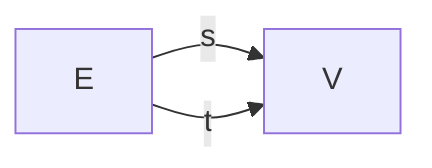
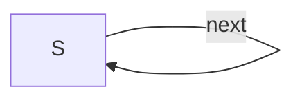

# Schema migration: Gr → DDS

This is the canonical specification for the schemas in
[`migration.lean`](migration.lean).  GitHub renders the mermaid blocks
below; `migration.lean` parses them at compile time (via `include_str`
plus a small parser in `Mermaid.lean`), so the rendered diagram and
the Lean data have a single source of truth.

A schema's mermaid block is identified by a `%% id: <NAME>` comment as
its first non-fence line.  Inside, only edge lines of the form

```
<src> -- <label> --> <tgt>
```

are read; everything else (`flowchart LR`, blank lines, etc.) is
ignored by the Lean parser but kept for visual rendering.

## Schema `Gr` — directed graphs

Two objects (`V`, `E`) and two parallel arrows from `E` to `V`:



## Schema `DDS` — discrete dynamical systems

One object `S` and a single self-loop `next : S → S`:



## Migration `F : Gr → DDS`

Object map: V ↦ S, E ↦ S.  Edge map: s ↦ identity (the empty path),
t ↦ next (a single-step path).

The migration data stays inline in `migration.lean` rather than being
read from this file — it's a four-line table and putting it through a
parser would be more obscure than helpful.
