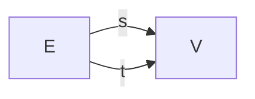
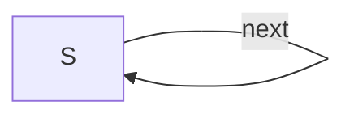
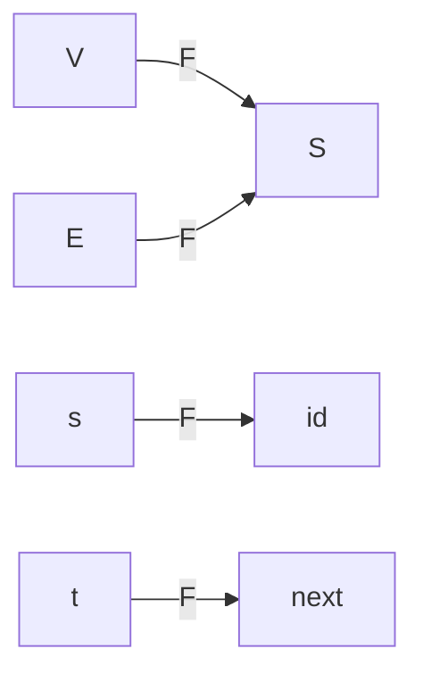

# Schema migration: Gr → DDS

Single source of truth for the **schemas** (`Gr`, `DDS`) and the
**migration functor** (`F`).  Three consumers read this file:

1. [`migration.lean`](migration.lean) — at elaboration time, via the
   `mermaid_pres!` term elab in [`Mermaid.lean`](Mermaid.lean) — to
   build the `Gr` and `DDS` categories and check the inline functor
   against the parsed `F`.
2. GitHub — to render the mermaid blocks below.
3. [`migrate.py`](migrate.py) — to emit PRQL implementing the migration
   triple Σ ⊣ Δ ⊣ Π over a user-supplied DuckDB instance:

   ```sh
   ./migrate.py migration.md mydb.duckdb > triple.prql
   prqlc compile -t sql.duckdb triple.prql | duckdb mydb.duckdb
   ```

   `mydb.duckdb` should already contain a table `DDS(s, next)` filled
   with a DDS instance.  See `sample.duckdb` (created on demand) for
   Fong's §3.11 example.

A schema's mermaid block is identified by a `%% id: <NAME>` comment as
its first non-fence line.  Inside, only edge lines of the form

```
<src> -- <label> --> <tgt>
```

are read; everything else (`flowchart LR`, blank lines, etc.) is
ignored by the Lean parser but kept for visual rendering.

## Schema `Gr` — directed graphs

Two objects (`V`, `E`) and two parallel arrows from `E` to `V`:



## Schema `DDS` — discrete dynamical systems

One object `S` and a single self-loop `next : S → S`:



## Migration `F : Gr → DDS`

The functor `F` is encoded as a single mermaid block whose edges are
`<gr-thing> -- F --> <dds-thing>`:

* If `<gr-thing>` is a `Gr` *object* (`V` or `E`), the line is part of
  the **object map**.
* If it's a `Gr` *arrow label* (`s` or `t`), the line is part of the
  **edge map**, and `<dds-thing>` is a path in `DDS` — either `id` for
  the empty path (the identity) or a `DDS` arrow label like `next`
  for a single-step path.



Reading this off: V↦S, E↦S, s↦identity, t↦next.
