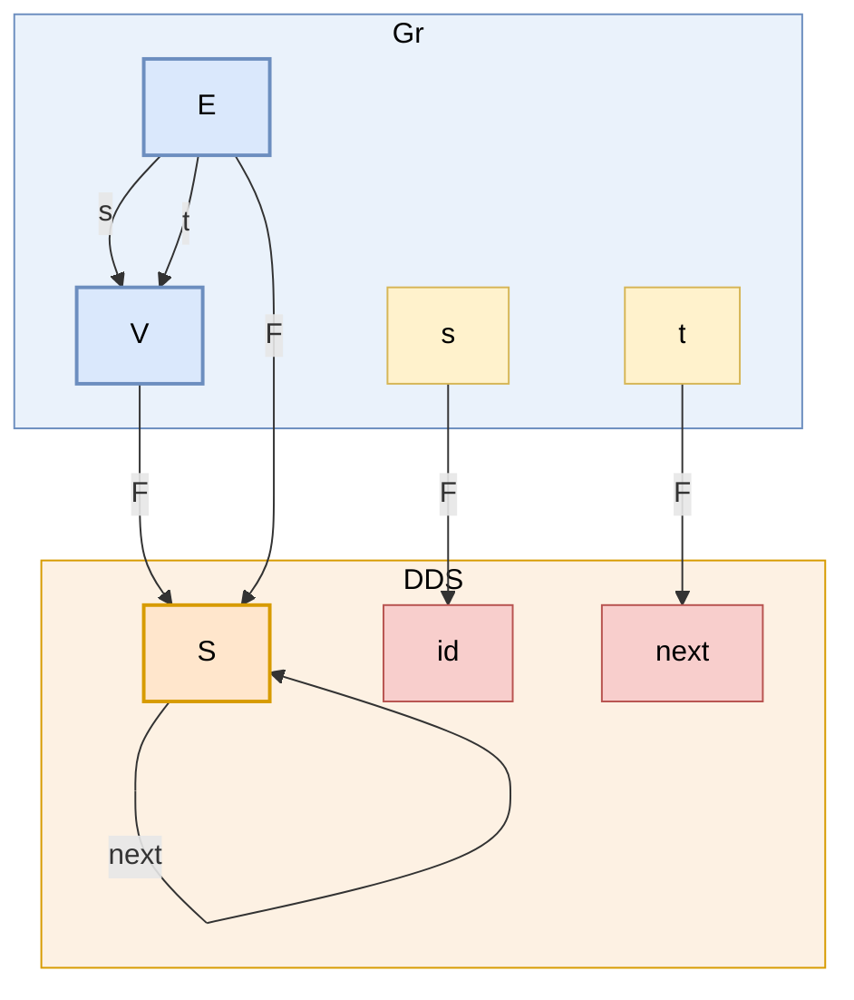

# Schema migration: Gr → DDS

Single source of truth for the **schemas** (`Gr`, `DDS`) and the
**migration functor** (`F`).  Three consumers read this file:

1. [`migration.lean`](migration.lean) — at elaboration time, via the
   `mermaid_pres!` term elab in [`Mermaid.lean`](Mermaid.lean) — to
   build the `Gr` and `DDS` categories and check the inline functor
   against the parsed `F`.
2. GitHub — to render the mermaid blocks below.
3. [`migrate.py`](migrate.py) — to emit PRQL implementing the migration
   triple Σ ⊣ Δ ⊣ Π over a user-supplied DuckDB instance:

   ```sh
   ./migrate.py migration.md mydb.duckdb > triple.prql
   prqlc compile -t sql.duckdb triple.prql | duckdb mydb.duckdb
   ```

   `mydb.duckdb` should already contain a table `DDS(s, next)` filled
   with a DDS instance.  See `sample.duckdb` (created on demand) for
   Fong's §3.11 example.

A schema's mermaid block is identified by a `%% id: <NAME>` comment as
its first non-fence line.  Inside, only edge lines of the form

```
<src> -- <label> --> <tgt>
```

are read; everything else (`flowchart LR`, blank lines, etc.) is
ignored by the Lean parser but kept for visual rendering.

## Schemas and the migration functor — one diagram

Both schemas and the functor `F : Gr → DDS` live in one mermaid block,
arranged top-to-bottom: source category `Gr` on top, target category
`DDS` on the bottom, each in its own subgraph with a tinted background.
The arrow names of each schema (`s`, `t` for `Gr`; `id`, `next` for
`DDS`) are also rendered as nodes inside their subgraphs so the F
mapping `s ↦ id`, `t ↦ next` can be drawn as actual arrows.

GitHub renders the whole thing as one graph; the parser splits it into
three logical sections by the `%% id:` markers (stopping at the next
marker or the closing fence).

* **Gr** — objects `V`, `E` in blue; arrow-name nodes `s`, `t` in yellow.
* **DDS** — object `S` in orange; arrow-name nodes `id`, `next` in red
  (we add `id` explicitly even though the identity is implicit in any
  category, so the F edge map can target it).
* **F** — solid `F`-labelled arrows from Gr-things to DDS-things:
  `V→S`, `E→S` (object map) and `s→id`, `t→next` (edge map).



Reading the F section off: V↦S, E↦S, s↦identity, t↦next.

## Generated PRQL for Σ ⊣ Δ ⊣ Π

These are the queries `migrate.py` emits for the schemas above.  They
assume the input DuckDB has a table `DDS(s, next)` for the DDS-side
direction, or tables `V(id)` / `E(id, s, t)` for the Gr-side direction.

### Δ_F : DDS instance → Gr instance (trajectory graph)

Each DDS row becomes a Gr-edge with `src = s` (because `F(s) = id`)
and `tgt = next` (because `F(t) = next`).  `V` is the deduplicated
state set.

```prql
let E = (from DDS | select { id = s, s = s, t = next })
let V = (from DDS | select { id = s } | group {id} (take 1))
```

### Σ_F : Gr instance → DDS instance (free DDS on G)

Each Gr-edge `u→v` is read as `next(u) = v`.  Conditional on each
vertex having ≤1 out-edge in `G` (otherwise targets must be
identified, which needs a quotient PRQL doesn't express directly).

```prql
let DDS_sigma = (from E | select { s = s, next = t })
```

### Π_F : Gr instance → DDS instance (trajectories)

The set of infinite trajectories in `G`.  Pure PRQL has no
recursion, so `migrate.py` emits a commented raw-SQL recursive CTE
template — set the bound `N` to the trajectory length you want:

```sql
WITH RECURSIVE traj(state, step) AS (
  SELECT id, 0 FROM E
  UNION ALL
  SELECT e.tgt, t.step + 1 FROM traj t
  JOIN E e ON e.id = t.state
  WHERE t.step < N
)
SELECT * FROM traj
```

### Round-trip check

`Σ_F ∘ Δ_F` should recover the original DDS instance.  On Fong's
§3.11 example:

```sh
duckdb sample.duckdb -c "CREATE TABLE DDS(s INT, next INT);
  INSERT INTO DDS VALUES (0,3),(1,3),(2,4),(3,4),(4,4),(5,6),(6,5);"

./migrate.py migration.md sample.duckdb \
  | grep '^let' \
  | (cat; echo 'from DDS_sigma | sort s') \
  | prqlc compile -t sql.duckdb \
  | duckdb sample.duckdb
```

returns the original 7 rows — and the `from E` query returns exactly
the trajectory triples `(id, src, tgt)` that the rfl tests in
`migration.lean` verify.
